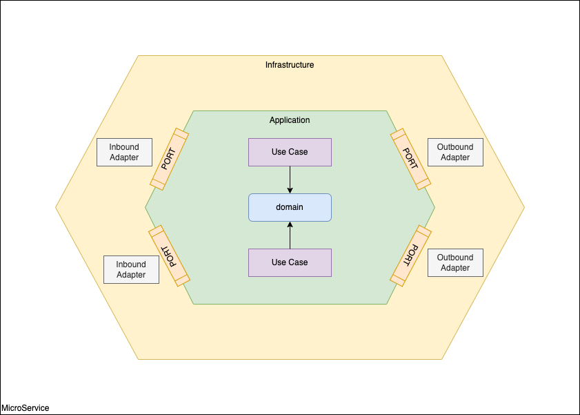
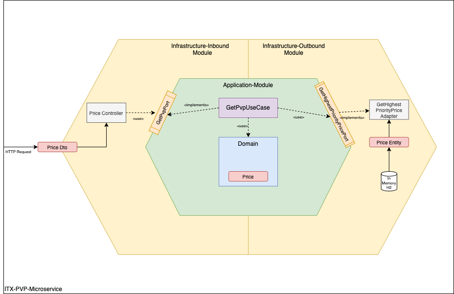

# INDITEX - Proceso de selección

## Consideraciones

Al analizar la tarea a realizar, se han identificado una serie de puntos ambiguos, que se detallan a continuación, así como las decisiones tomadas al respecto: 

### Tecnología

A dia de hoy, hay dos stack tecnológicos distintos para desarrollar un servicio SpringBoot Rest:
- Stack clásico, conocido como servlet 
- Stack reactivo, basado en la utilización de webflux

Desconociendo cuál es el stack tecnológico utilizado en Inditex, se ha decidido resolver la tarea dos veces:

- /inditex-pvp-servlet: Resuelve la tarea con un proyecto SpringBoot clásico (Servlet)
- /inditex-pvp-reactive: Resuelve la tarea utilizando Webflux


### Fechas de vigencia de los precios

La gestión de la fecha de vigencia de los precios puede realizarse teniendo en cuenta las zonas horarias o no.

#### Fechas con zona horaria

Implica que la hora en la que cambia un precio depende de la localización de la tienda (asumiendo que el sistema recoge las distintas tarifas del producto, ya sean para tienda física o para el canal online).

Si un precio debe entrar en vigor una fecha determinada, por ejemplo a las 14:00 UTC, la hora de vigencia de la nueva tarifa en cada tienda depende de su localización (y del uso horario del cliente online). Significa que en las tiendas de la península el cambio de tarifa sería a las 16:00, mientras que en Tenerife sería a las 15:00. En un país grande como EEUU, dependiendo del estado en el que se encuentre cada tienda, tendrá acceso al nuevo precio a una hora u otra, pudiendo haber grandes diferencias, incluso cambio de día.

#### Fechas sin zona horaria

Implica que si una tarifa entra en vigencia a las 14:00 horas, no importa dónde esté la tienda, debe cambiar la tarifa a sus 14:00 hora local. La tienda online deberá definir cuál es su uso horario (UTC para todos los usuarios, o en función de la localización del usuario).

#### Decisión

Dado que en los datos de ejemplo facilitados en la tarea no se indica zona horaria, y parece tener sentido que el precio entre en vigencia en base a una hora concreta, con independencia de la ubicación de la tienda, se ha decidido desarrollar:

- Proyecto SERVLET: NO tiene en cuenta la zona horaria:
Si una tarifa entra en vigencia a las 14:00, el servicio toma la zona horaria indicada por el usuario en la petición, y devuelve las 14:00 en su mismo uso horario. 

- Proyecto Reactive: SI tiene en cuenta la zona horaria:
En la bbdd se almacena un Instant en UTC. El servicio toma la zona horaria indicada en la petición, y calcula si el precio está vigente en la zona horaria de la petición.
Por ejemplo, un precio que entra en vigencia a las 14:00:00UTC: Si la fecha indicada en la petición está en un uso horario con una hora de diferencia, no le indicará que está vigente hasta las 15:00:00 de su uso horario (las 14:00:00 UTC)


#### Caso Real

En un caso real, la decisión a tomar debe estar guiada por el interlocutor de negocio.


### Colisiones

Tal y como indica la tarea, dado un BrandID, un ProductID y una fecha, puede haber varios registros en la bbdd con distintos precios y se utiliza el campo 'priority' para resolver la ambiguedad.

Ya que está involucrado un rango de fechas, no es posible crear un índice único para asegurar que el campo Priority no se repite.

Aun suponiendo que las especificaciones del servicio encargado de añadir los datos digan que no puede meter los datos por duplicado, es algo que podría ocurrir, por un error por ejemplo.

Nuestro servicio es el encargado de devolver el PVP, de modo que si ese caso ocurriera, no debería dar dos precios a elegir, ni debería devolver uno al azar.

#### Decisión

Se controla si la bbdd tiene más de un precio con la prioridad máxima para los criterios de entrada, y si es así, devuelve un error 409 (Conflicto)

_(Nota: Se han insertado registros en la bbdd para poder probar la colisión. Cualquier solicitud realizada para los mismos brandId y productId con fecha `2021-06-15` a cualquier hora, debe retornar un Conflicto)_

#### Caso Real

En un caso real se validaría con negocio si existe algún criterio de desambiguación adicional (por ejemplo, en caso de conflicto, quedarse con el último actualizado).

### Filtrado de precios

Se puede realizar en BBDD o por código.

#### En BBDD 

Implica:
- hacer un JOIN de la tabla consigo misma (para devolver solo los de mayor priodidad).
- algoritmos de ordenación y filtrado de la bbdd (eficientes)
- en función de la volumetría de los datos, un indice del campo prioridad ordenado descendentemente haría la búsqueda más eficiente aún.
- devuelve SOLO los registros que tienen prioridad máxima.

#### En Código

Implica:
- la bbdd devuelve directamente TODOS los registros que cumplen el criterio de entrada. 
-- No requiere joins en bbdd
-- Aumenta el tráfico de red, ya que devuelve todos y no solo los definitivos. (Si el numero de registros que cumplen los criterios de entrada fuese muy grande, este punto tomaría más relevancia. Pero dado el caso de uso aparentemente no debería ser así.)
- El código se encarga de buscar los de mayor prioridad.

#### Decisión

- El filtrado se realiza en la bbdd y devuelve los registros con max prioridad:
-- 0 -> El API devuelve un 404 Not Found
-- 1 -> El API lo devuelve
-- >1 --> El API devuelve un 409 Conflict 

#### Caso Real

- Valorar el nivel de carga soportado por los microservicios y la bbdd.
- Valorar la volumetría de datos:
-- ¿Cuántos precios puede haber vigentes en una misma fecha para un producto? 
-- ¿Cuántos registros tiene la tabla? 
-- ¿Cuál es la cardinalidad del BrandID y ProductID en la tabla para optimizar indices?
- Definir escenario de uso real, realizar POC de ambas aproximaciónes y ejecutar test de stress con volumetrías reales.

#### Alternativas

En caso de optar por realizar la búsqueda de el/los precio/s con mayor prioridad en el micro, el siguiente código sería aplicable:
```java
prices.collect(
    Collectors.collectingAndThen(
        Collectors.groupingBy(Price::priority),
        map -> {
          var pricesWithMaxPriority = Collections.max(map.entrySet(), Map.Entry.comparingByKey()).getValue();
          return switch (pricesWithMaxPriority.size()) {
            case 0 -> throw new PriorityCollisionException();
            case 1 -> return pricesWithMaxPriority.get(0);
            default -> throw new PriorityCollisionException();
          }
        }
    )
);
```

## Directrices generales

### API First

El proyecto ha sido generando siguiendo la metodología API First:
Primero se ha definido la [especificación del API](./inditex-pvp-servlet/spec/rest/pvp.yml) en formato estandarizado OpenAPI 3.
A partir de esta especificación, se ha autogenerado los DTOs y los Interfaces Servlet.

- ver [README.md](./inditex-pvp-servlet/spec/README.md) para ampliar información sobre la estructura del módulo con las especificaciones.
- Ver [CONTRIBUTORS.md](./inditex-pvp-servlet/spec/CONTRIBUTORS.md) para ampliar información sobre los criterios seguidos a la hora de diseñar el api.

### Arquitectura Hexagonal

La Arquitectura Hexagonal propone que nuestro dominio sea el núcleo de las capas y que este no se acople a nada externo. En lugar de hacer uso explícito y mediante el principio de inversión de dependencias nos acoplamos a contratos (interfaces o puertos) y no a implementaciones concretas.



### Proyectos multimódulo

Ambos proyectos siguen una estructura maven multi-módulo con la siguiente estructura:


- `spec`: Módulo sin código que recoge las especificaciones formales de las apis del servicio. En este caso utiliza OpenAPI para la especificación del endpoint REST. (Aquí también se incluirían los AsyncAPI, los esquemas Avro...).
  
  Desde este módulo se autogenera el código con los DTOs y los interfaces de los controladores.

  _(Este módulo solo está definido en el proyecto inditex-pvp-servlet. El proyecto inditex-pvp-reactive incluye esta dependencia, y hace uso de los DTOs autogenerados.)_
- `infrastructure-inbound`: Módulo de infraestructura que recoge todos los adapters que implementan los puertos driving o puertos de entrada.
- `infrastructure-outbound`: Módulo de infraestructura que recoge todos los adapters que implementan los puertos drived o puertos de salida.
- `application`: Módulo que contiene la lógica de negocio y los objetos de dominio.
- `launcher`: Módulo que tan solo contiene el punto de entrada de SpringBoot, así como configuraciones generales que apliquen a todos los módulos.
  Como es el punto de entrada de SpringBoot, también es el lugar donde se define el `application.yml` así como todos los resources del proyecto.

Esta estructura de proyecto nos permite:
- Autogenerar los DTOs en un .jar que puede ser importado por los proyectos que van a consumir el API para asegurar que ambas partes utilizan los mismos objetos de intercambio con las mismas validaciones.
  _(Este módulo solo está definido en el proyecto inditex-pvp-servlet. El proyecto inditex-pvp-reactive incluye esta dependencia, y hace uso de los DTOs autogenerados.)_
- Obligar a que cada capa maneje sus propios objetos (dtos, entidades, dominio), de modo que se evita devolver en el API un objeto de BBDD, o utilizar un DTO como parte del dominio, etc: Capas desacompladas por diseño.
- Evitar por diseño que desde los adapters de entrada se pueda utilizar los adapters de salida. La única opción que tiene cualquier entrada es pasar obligatoriamente por la capa de aplicación (Lógica de negocio).
  Con esto se evita por diseño que por ejemplo en un Controller se inyecte la dependencia de un Repository y se interactue directamente con la bbdd sin pasar por los casos de uso.
- Tener un punto común (launcher) que tiene visibilitad de todos los módulos, lo que permite ubicar en él todos los test de integración.
- Facilita exponer módulos del proyecto como dependencias a utilizar por otros proyectos. Por ejemplo, si se requiere un SharedKernel.

La arquitectura hexagonal queda adaptada a nuestro caso de uso:



### Calidad

El build de ambos proyectos tiene integrado:

- Checkstyle
- PMD
- Bugspot

Cualquier warning de cualquier analizador hace el build fallar.
Se han utilizado las reglas por defecto excepto en el tamaño máximo de línea: 140 caracteres

- Los proyectos tienen configurado el fichero `sonar-project.properties` para su integración con Sonar.

### Test Unitarios

Se ha incluido Jacoco en el build con un umbral de covertura del 100% tanto en líneas como en ramas.

Las únicas exclusiones son:
- /config
- (...)MapperImpl (Clases autogeneradas por MapStruct).

### Test de Integración

Ambos proyectos tienen los test de intración requeridos en la tarea.
- Adicionalmente, se han incluido los test de integración para validar los errores definidos en el API.
- Adicionalmente, se han incluido test de integración para validar los casos edge relacionados con el Offset de las fechas (en el proyecto `inditex-pvp-reactive` que es el único en el que aplica).
- Adicionalmente, se han incluido test de integración del Repositorio `PriceRepositoryIT` para validar los precios devueltos en los casos edge (Momento exácto, un instante antes, un instante posterior)

### Observabilidad

Ambos proyectos utilizan `micrometer`.

Los `traceId` y `spanId` están incluidos en las trazas de log.

Se observa el servicio `pvp.service` para poder sacar estadísticas de uso mediante el endpoint '/actuator/metrics/pvp.service'

### Logs

Criterio seguido para el nivel de logs:

- `debug`: datos relevantes a nivel técnico
- `info`: solo datos relevantes a nivel de negocio
- `warn`: errores de los que el sistema se puede recuperar
- `error`: errores de los que el sistema no se puede recuperar

### Modelo de datos

- Todas las columnas son obligatorias (no pueden tener valores null)
- El número de productos es elevado. Se crea un índice por la columna `product_id`
- El número de brands el pequeño. No se cre un índice porque aunque se utiliza en el filtrado su baja cardinalidad lo hace poco efectivo (valorar particionado por este campo).

### Otros

#### Cache

- El endpoint se ha diseñado teniendo en cuenta que pueda ser cacheado a nivel de llamada: Todos los parámetros viajan en la URL, no depende de cabeceras ni bodies.
- No se ha implementado la gestión de la cache, tratando de seguir el principio de responsabilidad simple.
- Se propone realizar la gestión de la cache a nivel de API Manager, o bien siguiendo el patrón Sidecar.

#### Seguridad

- El ejercicio no tiene requisitos de seguridad (Oauth o similares).
- Al igual que la cache, si se desea implementar un protocolo de seguridad, se sugiere realizarlo en el API manager o en un contenedor sidecar.

## Quickstart

### Precondiciones

- [Maven](https://maven.apache.org) 
- [Docker](https://www.docker.com)
- [Docker-compose](https://docs.docker.com/compose/)

### quickstart.sh

- Situarse en el directorio base del entregable.
- Ejecutar el comando

```bash
$ sh quickstart.sh
```

Este script realizará las siguientes acciones:
- Compilación del proyecto `inditex-pvp-servlet` 
- Construcción de la imagen docker del proyecto `inditex-pvp-servlet`
- Compilación del proyecto `inditex-pvp-reactive`
- Construcción de la imagen docker del proyecto `inditex-pvp-reactive`
- Levanta dos contenedores docker, uno con cada proyecto.

`inditex-pvp-servlet`:

- Endpoint: http://localhost:8881/pvp-api/v1/brands/1/products/35455/prices/pvp?date=2020-06-16T20:00:00Z
- Estadísticas de uso: http://localhost:8881/actuator/metrics/pvp.service

`inditex-pvp-reactive`:
- Endpoint: http://localhost:8882/pvp-api/v1/brands/1/products/35455/prices/pvp?date=2020-06-16T20:00:00Z
- Estadísticas de uso: http://localhost:8882/actuator/metrics/pvp.service

En este enlace se puede acceder al [Swagger UI](http://localhost:8881/swagger-ui/index.html) del proyecto.
