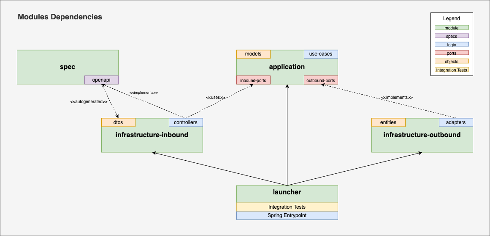

# ITX-PVP-REACTIVE

Micro service that gets the selling price `PVP` using reactive stack.

## Technologies

The project has the following technical stack:

- Java 17 (As it is the last LTS version)
- SpringBoot 3
- WebFlux
- H2-In-Memory (Database)
    - R2DBC
    - Flyway (database migrations manager)
- OpenAPI 3 (Api Spec)
- MapStruct (Objects mapper across layers)
- Micrometer (Observability)
- checkstyle, pmd, spotbugs
- jacoco reports

## Modules

- `infrastructure-inbound`: Driving Adapters implementation
- `infrastructure-outbound`: Drived Adapters implementatino
- `application`: Business Logic (Usecases) and domain objects.
- `launcher`: Springboot entrypoint



## Database Migrations

Flyway is used to manage database migrations.

The migrations must be placed in `launcher` resources folder.

The folder structure is:

    .
    ├── /db/migrations
         └── /common   
         │    └── *.sql                      # Migration scripts applied always
         ├── /local
         │    └── *.sql                      # Migration scripts applied when running `local` profile
         ├── /test
              └── *.sql                      # Migration scripts applied when running `test` profile (Integration Test)

## Build

In the root project folder run the following command:

```bash
$ mvn clean install
```

It will:
- compile the project modules
- run the unit tests (abort when there is a line or branch not covered)
- run the integration tests (abort when one test fails)
- run static analyzers: pmd, checkstyle, bugspot. (abort if any analyzer reports a warn)

## Generate docker image:

AFTER running the build, in the root project folder run the following command to build the docker-image `inditex-pvp-reactive:${project_version}`:

```bash
$ mvn -f launcher/pom.xml spring-boot:build-image
```

or moving to the `launcher` folder:

```bash
$ mvn spring-boot:build-image
```

## Launch

### Environment variables

| name                       | description                               | default value | mandatory |
|----------------------------|-------------------------------------------|---------------|-----------|
| R2DBC_URI                  | DB R2DBC connection uri                   |               | true      |
| JDBC_URI                   | DB JDBC connection uri (flyway)           |               | true      |
| ENV                        | running environment                       | local         | false     |
| LOG_LEVEL_ITX_PVP          | Log level for the service package         | info          | false     |
| LOG_LEVEL_SPRING_FRAMEWORK | Log level for the springframework package | info          | false     |
| LOG_LEVEL_ROOT             | Log level for any other package           | error         | false     |

### Run using mvn

```bash
$ mvn -f launcher/pom.xml spring-boot:run -Dspring-boot.run.jvmArguments="-DB_URI='jdbc:h2:mem:inditex;MODE=PostgreSQL;DATABASE_TO_LOWER=TRUE;DEFAULT_NULL_ORDERING=HIGH;DB_CLOSE_DELAY=-1'"
```

You can also make a previous export of the environment variables:

```bash
$ export JDBC_URI='jdbc:h2:mem:inditex;MODE=PostgreSQL;DATABASE_TO_LOWER=TRUE;DEFAULT_NULL_ORDERING=HIGH;DB_CLOSE_DELAY=-1'
$ export R2DBC_URI='r2dbc:h2:mem:///inditex;MODE=PostgreSQL;DATABASE_TO_LOWER=TRUE;DEFAULT_NULL_ORDERING=HIGH;DB_CLOSE_DELAY=-1'
$ mvn -f launcher/pom.xml spring-boot:run
```

### Run using docker

```bash
$ docker run -p 8882:8882 
  -e JDBC_URI='jdbc:h2:mem:inditex;MODE=PostgreSQL;DATABASE_TO_LOWER=TRUE;DEFAULT_NULL_ORDERING=HIGH;DB_CLOSE_DELAY=-1'
  -e R2DBC_URI='r2dbc:h2:mem:///inditex;MODE=PostgreSQL;DATABASE_TO_LOWER=TRUE;DEFAULT_NULL_ORDERING=HIGH;DB_CLOSE_DELAY=-1' 
  inditex-pvp-reactive:0.0.1-SNAPSHOT 
  --name pvp-reactive
```
