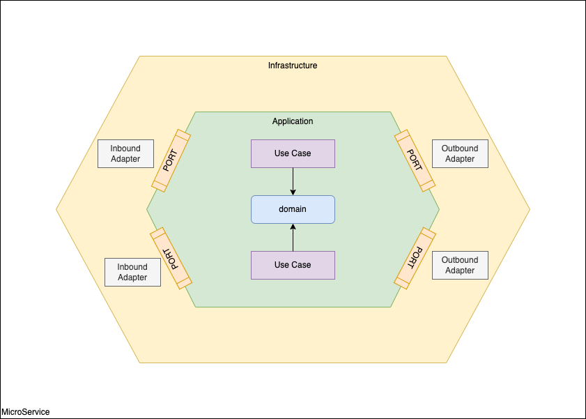
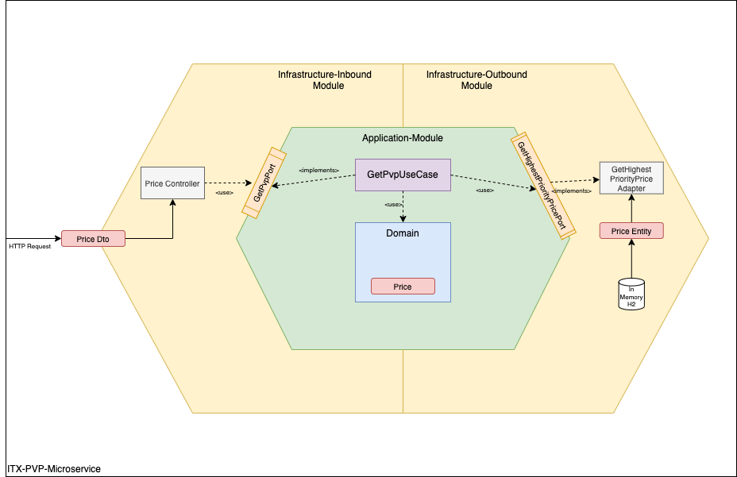
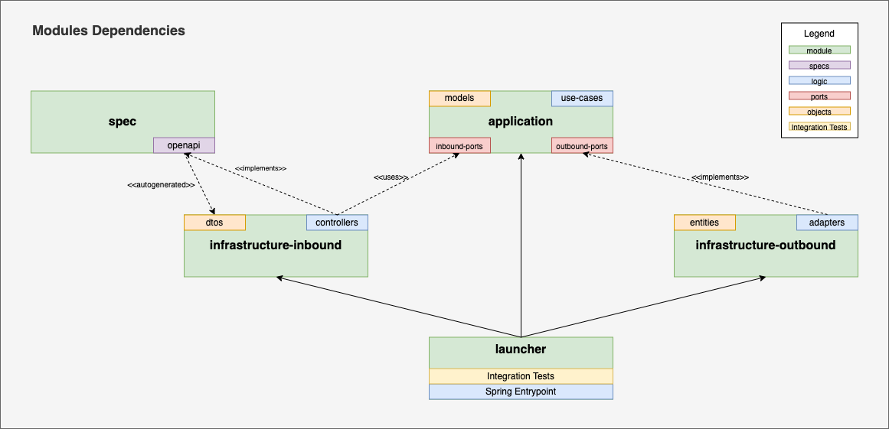

# ITX-PVP-SERVLET

Micro service that gets the selling price `PVP` using servlet stack.

## Technologies

The project has the following technical stack:
- Java 17 (As it is the last LTS version)
- SpringBoot 3
- H2-In-Memory (Database)
    - Flyway (database migrations manager)
- OpenAPI 3 (Api Spec)

## Architecture

### Generic Approach

TODO --> Explain

### Specific architecture

TODO --> Explain

## Modules Structure

TODO --> Explain

## Setup

TODO

## Launch

TODO

## Test

TODO
